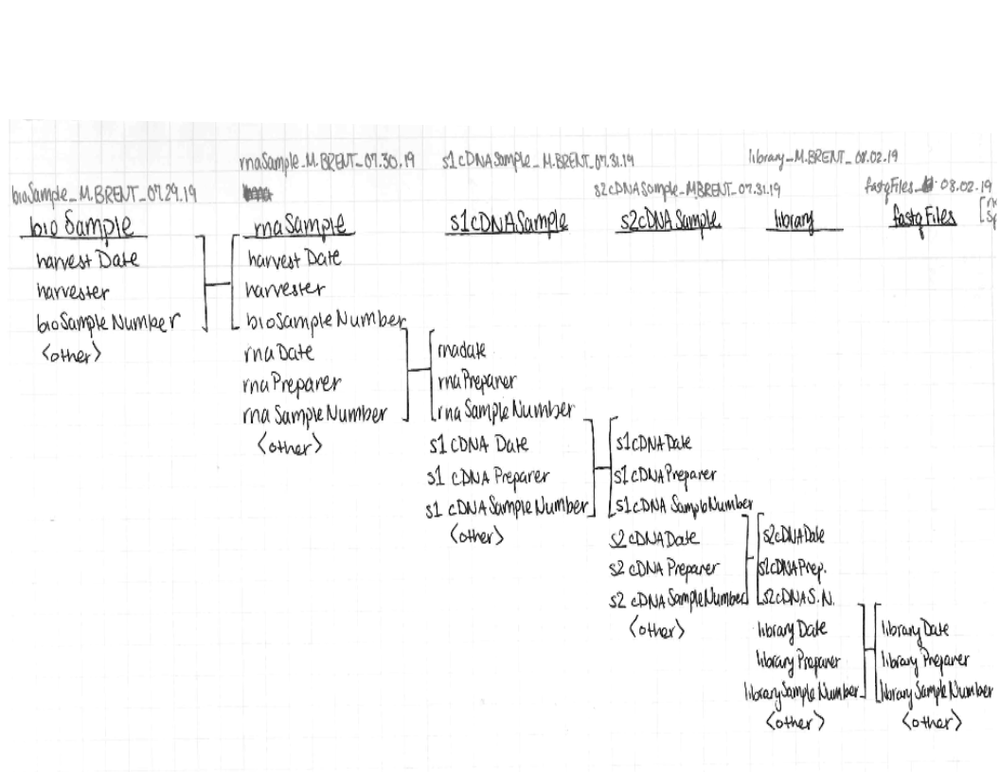

# General Specifications

The databases listed in this section are the datasets under current development in the Brent lab. Archived databases can be found in the brentlab htcf `/lts`.  

Generally, lab users will be filling in information through the database portal. There is also programmatic access, which is described in the [brentlabRnaSeqTools](https://github.com/cmatKhan/brentlabRnaSeqTools).

## The following conventions should be followed:  

- All fields have specifications. Please be careful to follow those specifications. Data that does not conform to the specifications will cause problems. When this happens, new constraints should be added to the database itself to prevent it from happening in the future.

- All dates should be in format: yyyymmdd, eg 20210517

- All names should be FIRSTINITIAL.LASTNAME, all caps. E.g. “M.BRENT”  

- Entries to the database should comprise that day's work. Please do not leave data entry to days other than the day the work was performed  

- In general, unless otherwise specifically noted, if there is no applicable entry for a column value in a given row, leave that entry blank

- Similarly, columns that are not required should be omitted if they do not apply to any row in a batch of entries  

The column headers for each file and what should be entered into them are listed below.

## Overall Metadata Design

## Table of Contents

1. **[KN99 Tables](./KN99_Tables/index.md)**
2. **[S28CR64 Tables](./S288C_R64_tables/index.md)**